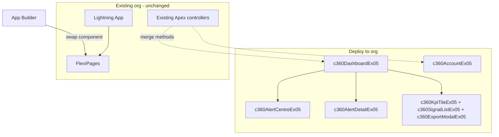

# Experiment 05 — Plan Summary

> Duplicated from Experiment 02 as the starting point for the next experiment. Update this document as scope evolves.

This document summarises the build plan for **Customer 360 Experiment 05**, an **LWC-only org overlay** aligned to output templates, design system, and wireframes. Experiment 01 remains frozen as reference.

---

## Build scope delivered in this folder

| Component | Purpose | Status |
|-----------|---------|--------|
| `c360DashboardEx05` | Monolithic hub — Overview, Alert Centre, Cross-Sell, Churn, Pathways, schema v3 Account | Built (mock data) |
| `c360AccountDetailEx05` | Tabbed account overview (Output schema v3): churn drill-down, cross-sell ROI sliders, decline chart | Built (mock data) |
| `c360KpiTileEx05` | Shared KPI child (`detail` / `variant` API) | Built |
| `c360SignalListEx05` | Shared signal child (`signalaction` / `signaldismiss`) | Built |
| `c360AlertCentreEx05` | Wireframe Alert Centre list + cross-sell panel | Built (mock data) |
| `c360AlertDetailEx05` | Wireframe alert drill-down + outcome form | Built (mock data) |
| `c360ExportModalEx05` | R04 PowerPoint export UI stub | Built |
| `c360AccountEx05` | Account Record Page — delegates to `c360AccountDetailEx05` | Built (mock data) |
| `c360MockDataEx05` | Shared mock DTOs + `getAccountDetail()` for sandbox UAT | Built |

**Not in deploy package:** Lightning App, FlexiPages, tabs, Apex classes (see `.forceignore`).

**Pilot scope implemented:** Option C (Hybrid) — `c360DashboardEx05` hub + Alert Centre LWCs + prototype PPT export modal retained.

---

## Architecture

---

## Authority hierarchy

| Tier | Source | Role |
|------|--------|------|
| 0–2 | `07. Knowledge for C360/` | Constraints, requirements, principles |
| IA | `10. Wireframe/` | Screen inventory, navigation, pilot UX |
| Visual | `09. Design system/` | SLDS 2 tokens, patterns (supersedes prototype CSS) |
| Code | `06. Output templates/` | LWC structure, `@wire` patterns, component APIs |
| Content | `04 C360 Prototype` | BR copy, interactions (fallback where wireframe silent) |

**Conflict resolution:** Wireframe wins IA; Design System wins visuals; Output templates win code structure; Prototype wins illustrative content when wireframe is silent.

---

## Assumptions (by topic)

### Org integration and deploy

- The target Salesforce org already has a **Customer 360 Lightning App**, **App Page flexipage**, and **Account Record flexipage** configured.
- Handover deploys **LWC bundles only** — apps, flexipages, tabs, and Apex are excluded via `.forceignore` and `manifest/packageLwcEx05.xml`.
- An admin will **swap the hub component** on the existing App Page from `c360App` (or equivalent) to `c360DashboardEx05` in Lightning App Builder after deploy.
- Org `apiVersion` is **62.0** (all `*.js-meta.xml` set accordingly; template originally used 67.0).
- Apex integration uses **merge into existing controllers**, not wholesale deploy of handover stubs.

### Product scope

- **Option C (Hybrid)** is the default pilot: monolithic dashboard + Alert Centre/Detail + PPT export modal.
- Alert Centre is **embedded in `c360DashboardEx05` navigation** (no separate flexipage required for pilot).
- Mock data runs in sandbox until org Apex is wired (Phase 5).
- `c360AccountEx05` is a **bootstrap** on the existing Account Record flexipage — full Spotlight gauge and `@wire` deferred to post–Phase 0c.

### Design and UX

- `09. Design system/` PNGs are the **visual token authority**; `design-rules.md` is principles-only.
- Branding uses **Global Payments** naming per output template.
- Account drill-down defaults to **inline SPA view**; Shift+click account links navigate to Salesforce Record Page (partial R14 mitigation).
- Wireframe persona (Sarah Jenkins, PILOT) is reflected in hub copy; prototype account names retained in mock data for continuity.

### Technical

- All dependent LWC bundles deploy in **one transaction**.
- SharePoint metadata stripped from template HTML before commit.
- Governor limit validation for monolithic dashboard + real Apex is deferred to client sandbox testing.

---

## Open questions (by topic)

### Org baseline (Phase 0c — blocking for production)

- What are the exact API names of the existing Lightning App, App Page flexipage, Account Record flexipage, and active hub LWC?
- Does the org use `c360App`, `c360DashboardEx05`, or another component name today?
- What is the org's confirmed `apiVersion` and any managed-package **namespace** prefix?
- Which Account Lightning Record Page is assigned org-wide / per record type?

### Hub strategy

- **Replace** `c360App` with `c360DashboardEx05` on the existing flexipage, or **evolve** `c360App` in the org to absorb template patterns?
- Should only one hub component remain active (deprecate Experiment 01 bundles in org)?

### Apex and data

- Which controller class(es) already exist (`C360PortfolioController` or equivalent)?
- Can new `@AuraEnabled` methods be added, or must existing signatures only be used?
- Do org DTO field names match wireframe/mock contracts, or is an LWC adapter layer required?
- Will Alert Centre/Detail require custom objects or Flows in production?

### Pilot scope and navigation

- Is Option C (Hybrid) confirmed, or should pilot shrink to Option A (template-only) or expand to Option B (full wireframe trio as separate pages)?
- Adopt wireframe **7-item nav** (Analytics, Customers, Reports, Settings) or current **5-item subset**?
- Keep **Churn as top-level tab** (prototype/template) or consolidate into Alert Centre only (wireframe)?

### Export and requirements

- R04 requires **PowerPoint**; wireframe shows **Export PDF** — deliver both, or prioritise one?
- Requirements registry entries are **Draft** — confirm sign-off before production.

### Record Page and deep linking

- Is inline account view acceptable for pilot, or is **NavigationMixin → Record Page** mandatory for all account links (constraint #1 / R14)?
- Should `c360AccountEx05` replace or sit alongside existing Account page components?

### Operations

- Confirm LWC-only deploy in **all client CI/CD pipelines** (no accidental flexipage push).
- What test coverage threshold must Apex merges meet before production deploy?

---

## Gap analysis — design inputs

### Source inventory

| Source | Provides | Does not provide |
|--------|----------|------------------|
| `07. Knowledge/design-rules.md` | SLDS baseline, UX principles, notification priority | Tokens, screen specs, IA |
| `09. Design system/` | SLDS 2 palettes, typography, elevation, pattern screenshots | C360-specific layouts |
| `10. Wireframe/` (3 PDFs) | Enterprise Account Hub, Alert Centre, Alert Detail IA | LWC code |
| `04 Prototype` | 6 views, 5 account subtabs, PPT export, Pets at Home data | Alert Centre, Health Index KPIs |
| `06. Output templates/` | `c360DashboardEx05` monolith, `leadSpotlight` `@wire` pattern | Child bundles, wireframe screens |
| `08. Experiments/01/` | Decomposed hybrid, illustrative metadata | Template-aligned APIs |

### Information architecture divergence

| IA element | Wireframe | Prototype | Template | Exp 04 build |
|------------|-----------|-----------|----------|--------------|
| Top-level nav | 7 items | 5 + Home | 4 tabs | **5 tabs** (Overview, Alert Centre, Cross-Sell, Churn, Pathways) |
| Primary landing | Enterprise Account Hub | Home launcher | Overview only | **Enterprise Account Hub** (wireframe KPIs) |
| Churn top-level | No (in Alert Centre) | Yes | Yes | **Yes** (prototype parity retained) |
| Alert Centre | Dedicated page | Inline only | None | **Dedicated nav + embedded LWCs** |
| Account detail | View/Action → Record | 5 subtabs | Inline simplified | **Inline + Shift+click Record Page** |
| RM persona | Sarah Jenkins, PILOT | Alex Rivera | Alex Rivera | **Sarah Jenkins, PILOT** on hub |

### KPI and content gaps

| Element | Wireframe hub | Prototype / template | Exp 04 |
|---------|---------------|------------------------|--------|
| Headline KPIs | Health Index, Revenue at Risk, etc. | 4 prototype KPIs | **6 KPIs** (wireframe extensions added) |
| Material changes banner | Yes | No | **Yes** |
| Portfolio table columns | Health Index, Δ, Revenue, Last activity | 7 prototype columns | **9 columns** (wireframe extensions) |
| Data provenance footer | Snowflake → SF, 15-min | No | **Yes** |
| Alert logic footnote | Documented IF rule | No | **Yes** (Alert Centre) |
| Outcome reporting form | Yes (Alert Detail) | No | **Yes** (UI stub) |
| PPT export (R04) | PDF in wireframe | PPT modal | **PPT modal retained** |

### Visual / token gaps

| Dimension | design-rules | 09 Design System | Prototype | Exp 04 |
|-----------|--------------|------------------|-----------|--------|
| Colour | Brand direction | SLDS 2 Foundation + Vibrant | Custom CSS vars | **CSS custom properties** aligned to SLDS 2 |
| Typography | SLDS family | Formal scale PNG | Ad-hoc px | **rem-based scale** |
| Elevation | Unspecified | Box shadow tokens | Custom shadow | **`--c360-shadow-*` tokens** |
| Branding | Worldpay pink | Platform-neutral | worldpay C360 | **Global Payments C360** |

### Template dependency gaps (resolved in Exp 04)

| Missing from templates | Exp 04 solution |
|------------------------|-----------------|
| `c360KpiTileEx05` child | Built with `detail` / `variant` API |
| `c360SignalListEx05` child | Built with `signalaction` / `signaldismiss` events |
| SharePoint junk in HTML | Stripped |
| Alert Centre / Detail | New `c360AlertCentreEx05`, `c360AlertDetailEx05` bundles |
| Apex wiring | Mock data + `classesStubsEx05/apexMergeGuideEx05.md` |

### Requirements coverage (Exp 04 vs sources)

| ID | Template alone | Exp 04 (Hybrid) | Gap remaining |
|----|----------------|-----------------|---------------|
| R01 Homepage / alerts | Partial | **Strong** | Real alert automation (Flow/Apex) |
| R03 Cross-sell | Yes | **Yes** | Live Data 360 propensity |
| R04 PPT export | No | **UI stub** | Backend doc service |
| R05 Explainability | Partial | **Stronger** | Live model drivers |
| R06 Pathways | Basic | Basic | SLA / dependencies (wireframe) |
| R07 Stakeholders | No | No | Not in any design source |
| R08 Proactive alerting | Inline | **Alert Centre** | Production alert logic |
| R12 Manager views | Toggle | **Alert detail visibility** | Live escalation workflow |
| R14 Deep links | At risk | **Partial** | Default is inline account view |

### Mock data divergence

| Aspect | Wireframe | Exp 04 mock |
|--------|-----------|-------------|
| Hero accounts | Acme, InTech, Summit | Prototype names + Acme/InTech in alerts |
| Products | Smart Routing, Tokenisation | Revenue Boost, FX (prototype) |
| Currency | GBP + USD mixed | GBP primary, USD on InTech alert |

---

## Phased roadmap (remaining work)

| Phase | Description | Status |
|-------|-------------|--------|
| 0 | Study templates, design system, wireframes | Documented in this summary |
| 0b | Wireframe reconciliation — Option C chosen | Done (assumption) |
| 0c | Org baseline retrieve | **Not started** — client action |
| 1 | LWC-only scaffold | **Done** |
| 2 | Shared children | **Done** |
| 3 | Port `c360DashboardEx05` + design tokens | **Done** |
| 4 | Wireframe screens (Alert Centre/Detail) | **Done** (UI mock) |
| 4b | Export modal, NavigationMixin partial | **Done** |
| 5 | Wire to org Apex | **Not started** |
| 6 | Full `c360AccountEx05` Spotlight + Record Page | **Bootstrap only** |
| 7 | Handoff + org wiring | **Done** (runbook + checklist) |

---

## Related documents

- [README.md](README.md) — quick start and deploy instructions
- [orgWiringRunbookEx05.md](orgWiringRunbookEx05.md) — App Builder wiring steps
- [handoffChecklistEx05.md](handoffChecklistEx05.md) — pre/post deploy verification
- [classesStubsEx05/apexMergeGuideEx05.md](classesStubsEx05/apexMergeGuideEx05.md) — Apex merge reference
